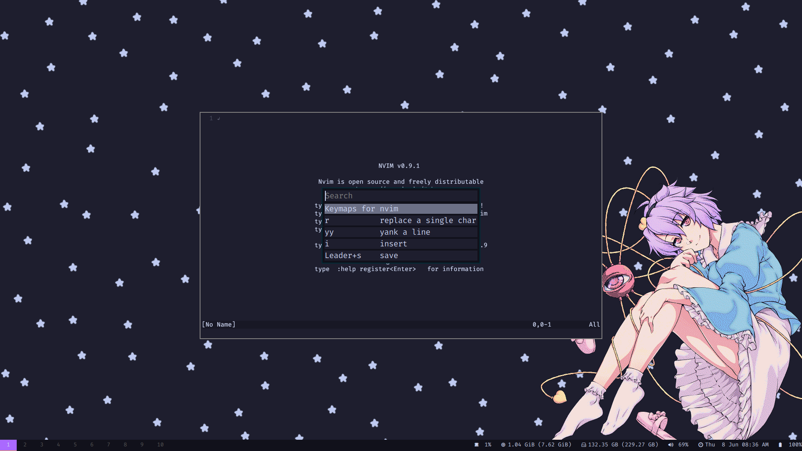

# HOTKEY-ROFI


# Introduction

A simple bash script for reading the hotkeys of the active program from a defined file.

The bash script is just a prototype as I plan to rewrite and expand this in python.

# Usage

Add this directory to the ~/.config/rofi/ directory,
You will aslo need to add a text directory within this and
populate it with text files for the script to read.

For an example of usage, this is what's in my sxhkdrc
```
super + k
    rofi -modi "hotkey-rofi":"~/.config/rofi/hotkey-rofi/hotkey-rofi" -show "hotkey-rofi" -config "~/.config/rofi/hotkey-rofi/hotkey-rofi.rasi"
```
You can omit or use your own .rasi config, The rasi file used coincides with my main config file foun
in my dotfiles.

# License
```
This project is free software: you can redistribute it and/or modify it under the terms of the GNU General Public License as published by the Free Software Foundation, 
either version 3 of the License, or any later version.

This project is distributed in the hope that it will be useful, but WITHOUT ANY WARRANTY; 
without even the implied warranty of MERCHANTABILITY or FITNESS FOR A PARTICULAR PURPOSE. 
See the GNU General Public License for more details.

You should have received a copy of the GNU General Public License along with this code. 
If not, see <https://www.gnu.org/licenses/>. 
```